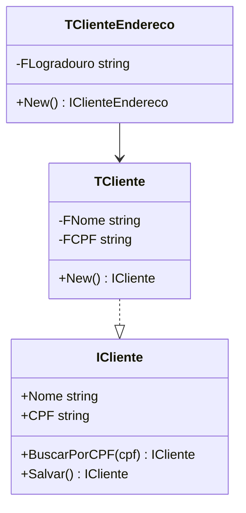

# Documentation OOP First

## Responsabilidade única

Garantir que projetos sem código-fonte partam de um **design OOP explícito** antes de qualquer outra documentação. Esta skill define o fluxo obrigatório: módulos → interfaces → hierarquia → diagrama → somente então features, RNs e endpoints. Documentação escrita antes do design OOP é prematura e será inconsistente.

## When to use

- Projeto novo sem código-fonte existente (inception)
- Redesign de módulo a partir do zero (sem código atual)
- Inception documental para proposta ou escopo técnico
- Qualquer situação onde a pergunta é "como começar a documentar um sistema que ainda não existe?"

## When NOT to use

- Projeto com código-fonte existente → usar `documentation-paste_analysis_unit_class_method_V1.2.0` para analisar o código e gerar docs
- Documentar feature de módulo já implementado → usar `documentation-project-feature_V1.1.0`
- Adicionar RN a módulo existente → usar `documentation-business-rules_V3.1.0`

## Fluxo obrigatório — 5 passos

### Passo 1 — Identificar módulos de negócio

Listar os domínios de negócio do sistema. Cada módulo de negócio se torna uma **classe mestra** (`TModulo`).

```text
Sistema ERP de exemplo:
  - Clientes   → TCliente
  - Financeiro → TFinanceiro
  - Fiscal     → TFiscal
  - Estoque    → TEstoque
```

### Passo 2 — Definir interfaces antes de implementações

Para cada módulo, criar a interface pública (`IModulo`) antes de qualquer implementação. A interface define **o que** o módulo faz — não **como**.

```pascal
ICliente = interface
  function BuscarPorCPF(const ACPF: string): ICliente;
  function Salvar: ICliente;
  property Nome: string;
  property CPF: string;
end;
```

### Passo 3 — Mapear submódulos

Identificar entidades relacionadas de cada módulo master e criar `TModuloSubclasse`.

```text
TCliente (master)
  ├── TClienteEndereco
  ├── TClienteContato
  └── TClienteDocumento
```

### Passo 4 — Criar diagrama de hierarquia

Gerar diagrama Mermaid `classDiagram` ou ASCII antes de escrever qualquer feature.



### Passo 5 — Escrever documentação de features, RNs e endpoints

**Somente após** os 4 passos anteriores, iniciar:

- Features: cada feature referencia a classe responsável (`TCliente.Salvar`)
- Regras de negócio: indicam a interface que as implementa (`ICliente`)
- Endpoints REST: indicam a camada de apresentação que chama o serviço

## Regra de rastreabilidade

Toda documentação de feature ou endpoint deve referenciar a classe responsável:

```markdown
## Feature: Cadastro de Cliente
**Classe responsável:** `TCliente` (implementa `ICliente`)
**Serviço:** `TClienteService` (implementa `IClienteService`)
```

## Template de artefato inicial

Ver `templates/TEMPLATE_oop_project_design.md` para o template completo de "Design OOP Inicial" com todas as seções obrigatórias.

## Dependências

- `developer-delphi-programming-oop-naming_V1.0.0` — convenções TModulo/IModulo/TModuloSubclasse
- `documentation-overview-architecture_V1.1.0` — modelo de qualidade para docs de arquitetura

## Skills relacionadas

- `documentation-business-rules_V3.1.0` — formalizar RNs após ter o design OOP
- `documentation-project-bootstrap_V2.1.0` — inicializar estrutura `Documentation/` após design OOP
- `documentation-master-orchestrator_V1.1.0` — orquestrador da família documentation-*

---

## Versão interna (arquivo)

| Campo | Valor |
| --- | --- |
| **FileVersion** | 1.0.0 |
| **Política** | `.cursor/VERSION.md` |

## Changelog

- 1.0.0 (13/04/2026): Criação — fluxo obrigatório OOP-first para documentação de projetos sem código-fonte.