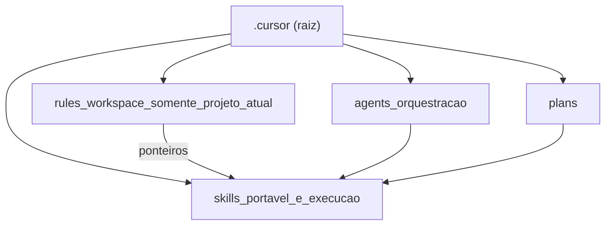
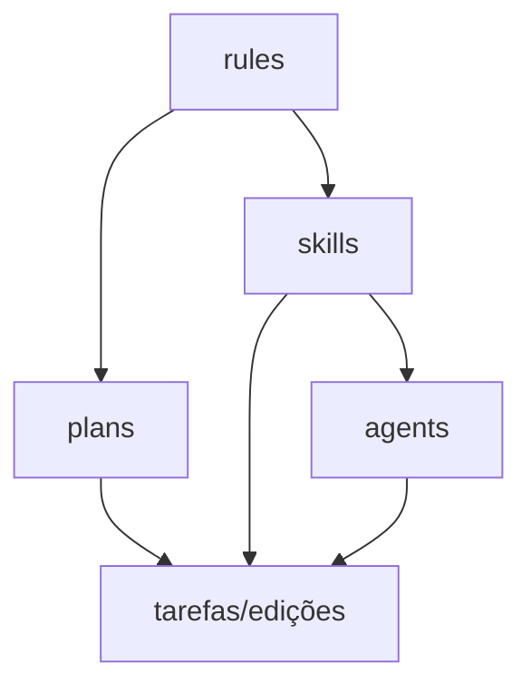

# Documentation Rules Creator

## Responsabilidade única

Esta skill é a **dona da interação entre `.cursor/rules/` e skills/agents** — ela decide o que
fica como regra do workspace (específico deste repositório) e o que deve ser movido para skills
portáteis. Ela cria ou recria os 5 templates de rules (`project-fundamentos`, `documentation-project-structure`,
`project-documentacao`, `project-roadmap`, `project-exemplos`) a partir de evidências reais do
código, garantindo que nenhum bloco genérico inflacione as regras. Existe separada das skills
`documentation-*` porque tem como output principal **arquivos `.mdc` em `.cursor/rules/`**, não
artefatos de `Documentation/` ou `Analise/`.

## Princípio obrigatório: `.cursor/rules` só o projeto atual

**Esta skill é a dona da interação** entre o que fica em **`.cursor/rules/*.mdc`** e o que vive em **skills** (`.cursor/skills/`) ou **agents** (`.cursor/agents/`).

| Onde escrever | Conteúdo permitido |
|---------------|-------------------|
| **`.cursor/rules/`** | Apenas o que é **específico deste repositório**: paths do workspace, stacks e módulos deste produto, decisões de arquitetura **da app**, roteiros e domínio **deste** código, inventários **deste** `Analise/`, referências a ficheiros **deste** `src/`/`Data/`, checklists de fases **deste** roadmap. Pode incluir **ponteiros** (uma linha + path) para skills quando o tema for genérico. |
| **Skills `documentation-*` / `project-*`** | Padrões **reutilizáveis entre projetos**: scaffold e árvore de `Analise/` (paste_analysis), fluxo transversal (general_rules), matriz de lacunas (project-feature), scan, migração com backup, compile/roteiro/diretivas ORM (project-*), ecossistema template `Documentation/` (orchestrator + skills documentation-* da pasta documental). |
| **Agents (ex.: `doc-agent-orchestrator`)** | Orquestração de tarefas documentais **genéricas** (hub `Documentation/`, migração, roadmap): delegam para skills; **não** substituem `.cursor/rules` como fonte de verdade **do workspace**. |

**Regra de ouro:** ao criar ou rever um `.mdc` em `.cursor/rules/`, cada secção deve passar no teste: *“Isto aplicar-se-ia igual noutro repositório sem este código?”* — Se **sim**, **mover ou apontar** para a skill/agent adequado; se **não**, mantém-se na regra.

**Sem skill dona para o tema portátil:** criar nova skill sob `.cursor/skills/documentation-<tema>_V{MAJOR.MINOR.PATCH}/SKILL.md` (sufixo da pasta = **FileVersion** / versão SemVer do `SKILL.md`), registar em `.cursor/README.md`, e **deixar na regra apenas** uma linha do tipo: “Ver skill `documentation-<tema>`.” Não duplicar o corpo portátil dentro da regra.

## Política: `.cursor/rules` vs skills / agentes

Síntese alinhada ao anfitrião (este repositório) vs portátil:

| Camada | Papel |
|--------|--------|
| **`.cursor/rules/*.mdc`** | Sintetizam **evidências do repo actual**; não duplicam tutoriais genéricos de documentação nem a árvore `Analise/` (dono: `documentation-paste_analysis_unit_class_method`). |
| **Skills `documentation-*` / `project-*`** | Procedimentos **reutilizáveis**; podem ser copiados para outro projeto **sem** os `.mdc` específicos deste ORM. |
| **Agents (`doc-agent-*`, `dev-agent-*`)** | Orquestram skills e apontam para `.cursor/rules` **só** quando o contexto é este workspace. Convenção de nomes: skill **`documentation-general_rules`**. |

### Checks ao gerar ou rever rules

1. **Remover** bloco genérico se existir skill dona; **substituir** por uma linha: «Ver skill `…`.»
2. **Não** copiar para `.mdc` o template de **`{ClassName}.md`** (`T…` / `I…`), modos scaffold, nem matriz anti-perda de migração — remete a paste_analysis / migration-backup / project-feature conforme o caso.
3. **Agents** não substituem rules como fonte do anfitrião: referenciam `Inicial_V1.0.mdc`, `roadmap_V1.0.mdc`, etc., para decisões **deste** código.
4. **Nova lacuna portátil sem skill:** criar `documentation-<tema>` e registar em `.cursor/README.md`; `documentation-general_rules` só para transversal **sem** dona mais específica.

## When NOT to use

- Para criar artefatos em `Documentation/` ou `Analise/` → usar `documentation-project-bootstrap` ou `documentation-paste_analysis_unit_class_method`
- Para revisar qualidade de documentação por feature → usar `documentation-project-feature`
- Para inventariar artefatos documentais → usar `documentation-project-scan`
- Para migrar/arquivar documentação → usar `documentation-migration-backup`
- Para orquestrar pipeline de documentação multi-etapa → usar `doc-agent-orchestrator`

## Dependências (skills prévias)

| Skill | Quando executar antes |
|-------|-----------------------|
| `documentation-paste_analysis_unit_class_method` | Quando `Analise/` estiver ausente ou incompleta — invocar antes para garantir scaffold base |

## When to use

- Quando o usuário pedir para gerar regras do zero em `.cursor/rules/`.
- Quando os templates `project-*.mdc` (ou os arquivos legados `Documentacao_V1.0.mdc`, `Inicial_V1.0.mdc`, `local_arquivos_V1.0.mdc`, `roadmap_V1.0.mdc`) estiverem ausentes, desatualizados ou incoerentes com o projeto.
- Quando for necessário consolidar evidências de `src/`, `Data/`, `Analise/` e `Documentation/` em um conjunto único de regras **do workspace**, sem inflar as regras com texto genérico que já tem skill.
- Quando o usuário pedir para alinhar “só projeto nas rules, o resto nas skills/agents”.

> **Nota:** esta skill NÃO cria nem mantém a pasta `Analise/`. A **fonte única** para finalidade, estrutura e scaffold de `Analise/` é **`documentation-paste_analysis_unit_class_method`**. Ordem de invocação entre skills documentais: **`documentation-general_rules`**. Invocar o paste antes desta skill quando `Analise/` estiver ausente ou incompleta.

## Templates e modelo de referência

Os **5 arquivos genéricos** em `.cursor/rules/` são o ponto de partida para qualquer projeto novo:

| Template | Cobre |
| -------- | ----- |
| **`project-fundamentos_V1.0.mdc`** | Identidade, nomenclatura (prefixos, Fluent, Factory), exceções, padrões de design, legenda, agents/skills |
| **`project-estrutura_V1.0.1.mdc`** | Árvore de pastas, pacotes de terceiros, configuração de compilação, artefatos de build, CLI de dados |
| **`project-documentacao_V1.0.mdc`** | Matriz de responsabilidades, convenção `Analise/`, roteiros de uso, preocupações transversais |
| **`project-roadmap_V1.0.mdc`** | Visão estratégica, fases, hierarquia de módulos, checklists de status, critérios de qualidade, backlog |
| **`project-exemplos_V1.0.mdc`** | Padrão de uso central, cenários por componente, wiring do ecossistema, anti-padrões |

**Como usar em um projeto novo:**

1. Os templates já existem em `.cursor/rules/` — copiar para o `.cursor/` do novo projeto (renomear se necessário).
2. Substituir todos os `{PLACEHOLDER}` pelos valores reais do projeto.
3. Remover ou substituir as linhas `<!-- EXAMPLE (ORM): ... -->` pelo conteúdo real.
4. Deletar as seções `## Como usar este template` de cada arquivo.
5. Atualizar `.cursor/README.md` do novo projeto com os nomes finais.

**Modelo ORM (exemplo completamente preenchido):** os arquivos V2.0 com placeholders estão em `.cursor/skills/project-init-rules-generator_V1.0.0/templates/`. Os comentários `<!-- EXAMPLE (ORM): -->` nos templates indicam os valores de referência do ProvidersORM.

> **Regra de ouro:** ao criar ou rever um `.mdc` em `.cursor/rules/`, cada seção deve passar no teste: *”Isto aplicar-se-ia igual noutro repositório sem este código?”* — Se **sim**, **mover ou apontar** para a skill/agent adequado; se **não**, mantém-se na regra.

## Diretriz de templates master

- Skills com prefixo `documentation` e `projeto` são templates master.
- Alterações nesses templates só podem ocorrer por solicitação direta e explícita do usuário.
- Sem solicitação explícita, o agente deve usar as skills existentes sem editar conteúdo.
- Se houver necessidade de mudança:
  - registrar pendência
  - solicitar autorização explícita para alterar skill existente ou criar nova
  - confirmar classificação da mudança: `documentation`, `projeto` ou outra.

## Inputs

1. `<project_root>`: raiz do projeto (padrão: `.`).
2. `<fonte_codigo>` (opcional): padrão `src/` — lido como evidência, não sofre scaffolding aqui.
3. `<fonte_dados>` (opcional): padrão `Data/`.
4. `<fonte_analise>` (opcional): padrão `Analise/` — lido como evidência; se ausente, invocar `documentation-paste_analysis_unit_class_method` primeiro.
5. `<fonte_docs>` (opcional): padrão `Documentation/` (legado: `docs/` ou `Docs/` na raiz — renomear para `Documentation/`).
6. `<profundidade>` (opcional): `rapida`, `padrao` (default) ou `profunda`.
7. `<idioma_saida>` (opcional): `pt-BR` (default).

## Outputs obrigatorios

1. Rules canônicas criadas/revisadas (nomes preferidos para projeto novo):
   - `.cursor/rules/project-fundamentos_V1.0.mdc`
   - `.cursor/rules/project-estrutura_V1.0.1.mdc`
   - `.cursor/rules/project-documentacao_V1.0.mdc`
   - `.cursor/rules/project-roadmap_V1.0.mdc`
   - `.cursor/rules/project-exemplos_V1.0.mdc` (quando aplicável)

   > **Projetos com convenção própria de nomes:** podem manter os nomes legados (`Inicial_V1.0.mdc`, `local_arquivos_V1.0.mdc`, `Documentacao_V1.0.mdc`, `roadmap_V1.0.mdc`, `Exemplos_ORM_V1.0.mdc`). Os templates V2.0 em `.cursor/skills/project-init-rules-generator_V1.0.0/templates/` servem como referência independente dos nomes de arquivo.

2. Verificação de faltantes críticos:
   - `.cursor/skills/developer-delphi-programming-conditional-defines_V1.0.0/exemplos/diretivas_compilacao.md` ou equivalente de diretivas do projeto.
   - Coerência de exceções/commons entre as rules.
3. Atualização de índice:
   - `.cursor/README.md`
4. Relatório curto de consolidação/choque (com decisão de roteamento entre skills).

## Escopo funcional por arquivo

### `project-fundamentos_V1.0.mdc` (legado: `Inicial_V1.0.mdc`)

- Identidade do projeto: stack, entry point, API pública, commons.
- Nomenclatura: prefixos de interface/classe, Fluent, Factory, variáveis, records, enums.
- Exceções: base, hierarquia, faixas de código por módulo.
- Padrões de design obrigatórios: Fluent, Factory, gestão de recursos, responsabilidade única.
- Diretivas de compilação / módulos opcionais (remover se não aplicável).
- Subagents e Skills de referência: tabela com nome, path e quando usar.
- Regras rápidas para o agente.

### `project-estrutura_V1.0.1.mdc` (legado: `local_arquivos_V1.0.mdc`)

- Árvore de diretórios do repositório com `{placeholders}` para cada pasta.
- Pacotes e dependências de terceiros por categoria.
- API pública e regra de encapsulamento (facades, nunca units internas).
- Configuração de compilação e saídas de build.
- Acesso a dados: arquivos de config, tabela CLI por banco.
- Módulos externos integrados: repo-fonte / path interno / diretiva.
- Tabela de documentação relevante com paths canônicos.

### `project-roadmap_V1.0.mdc` (legado: `roadmap_V1.0.mdc`)

- Visão estratégica, objetivos e diagrama de fases (Mermaid).
- Hierarquia de módulos / níveis com tabela de interfaces e implementações.
- Checklist de status por grupo de módulos (`[ ]` / `[X]`).
- DDL, DML e restrições de campos (remover se não aplicável).
- Fases detalhadas com entregáveis e critérios de aceite.
- Backlog por prioridade (A/M/B).
- Critérios gerais de qualidade e referência de arquivos-fonte.

### `project-documentacao_V1.0.mdc` (legado: `Documentacao_V1.0.mdc`)

- **Específico do projeto** (paths, domínio, referências locais): manter nesta regra.
- **Genérico / portátil:** scaffold `Analise/` → skill **`documentation-paste_analysis_unit_class_method`**; qualidade/matriz → **`documentation-project-feature`**; fluxo transversal → **`documentation-general_rules`**.
- Matriz de responsabilidades: tabela mapeando necessidade → rule/skill.
- Roteiros de uso por modo com passos e units mínimas.
- Preocupações transversais: exceções, commons, regras de fonte única.
- Como criar ou alterar documentação: lista de skills em ordem.

### `project-exemplos_V1.0.mdc` (legado: `Exemplos_ORM_V1.0.mdc`)

- Padrão central de uso (dois padrões alternativos + injeção de dependência).
- Cenários por componente com snippets mínimos.
- Módulo ou componente especial (remover se não houver).
- Composição do ecossistema / wiring completo com roteiro canônico.
- Anti-padrões: tabela com problema, motivo e alternativa correta.
- Apêndice de scripts e dados de apoio (remover se não aplicável).

## Passos executaveis

### 1) Descoberta e inventario

- Inventariar estrutura real de `src/`, `Data/`, `Analise/`, `Documentation/`.
- Mapear lacunas, duplicações, divergências semânticas e inconsistências de naming.
- Registrar evidências objetivas de cada achado.

### 2) Mapeamento regra -> evidencia

- Para cada rule alvo, mapear quais evidências alimentam cada seção.
- Evitar inferência sem base: ausência de evidência deve virar pendência explícita.

### 3) Geração/revisão das 4 rules

- Criar ou atualizar conteúdo com foco em coerência entre regras.
- Remover ambiguidade de responsabilidades entre arquivos.
- **Aplicar o princípio “rules = só projeto atual”:** retirar ou condensar texto portátil; substituir por links às skills/agents; caminhos **deste** workspace quando necessário (absolutos só se já for convenção do repo).

### 4) Faltantes críticos no escopo

- Se `.cursor/skills/developer-delphi-programming-conditional-defines_V1.0.0/exemplos/diretivas_compilacao.md` não existir ou estiver incompleto, registrar criação/revisão no backlog de execução.
- Se a secção de exceções em **Documentacao_V1.0.mdc** ou **EXCEPTIONORM** em **local_arquivos_V1.0.mdc** estiver incompleta face ao código, registrar revisão no backlog de execução.
- Sempre atualizar `.cursor/README.md` com referências consistentes ao estado final.

### 5) Verificação de choque com skills existentes

- Comparar escopo com:
  - `documentation-project-feature`
  - `documentation-project-scan`
  - `documentation-project-bootstrap`
  - `documentation-portal-html`
  - skills `project-*`
- Classificar sobreposição (`alta`, `moderada`, `baixa`) e definir roteamento.

### 6) Matriz de roteamento sem conflito

- Definir claramente:
  - `documentation-rules_creator` => geração/manutenção de `.cursor/rules`
  - `documentation-project-feature` => qualidade da pasta `Analise/`
  - `documentation-portal-html` e `documentation-*` => ecossistema `Documentation/`
  - `project-*` => domínio técnico e convenções do projeto
- Incluir cláusula explícita de não-substituição entre essas responsabilidades.

### 7) Arvore de prioridade

- Documentar prioridade em dois eixos:
  - governança
  - execução prática
- Usar árvore curta e objetiva para orientar decisões do agente.

## Matriz rápida: tipo de conteúdo para onde vai

| Tipo de conteúdo | Destino |
|------------------|---------|
| Estrutura física `Analise/`, **`{ClassName}.md`** (`T…` / `I…`), scaffold | `documentation-paste_analysis_unit_class_method` |
| Ordem entre skills, pacote multi-repo, changelog `.md` portátil | `documentation-general_rules` |
| Lacunas, RN, checklist qualidade sobre docs de análise | `documentation-project-feature` |
| Inventário amplo artefactos | `documentation-project-scan` |
| Migração `Documentation/` + backup | `documentation-migration-backup` |
| ORM, compile, DB CLI, diretivas, roteiro uso código | `project-*` |
| Hub `Documentation/`, roadmap documental genérico, migração template | agent `doc-agent-orchestrator` + skills `documentation-*` de `Documentation/` |
| Ficheiros-modelo **`TEMPLATE_*`** (`Analise/` + `Documentation/`) | **`.cursor/Templates/`** (índice `README.md`); skills `documentation-*` copiam antes de preencher |
| **Paths, decisões, roteiros só deste repo** | `.cursor/rules/*.mdc` |

## Arvore de prioridade (governanca)

## Arvore de prioridade (execucao pratica)

## Analise de choque e consolidacao (baseline)

| Skill | Choque | Domínio desta skill | Domínio da outra | Resolução |
| --- | --- | --- | --- | --- |
| `documentation-paste_analysis_unit_class_method` | Nenhum | `.cursor/rules/` | `Analise/` (dono: scaffold + estrutura) | Complementar — rodar antes desta |
| `documentation-general_rules` | Nenhum | `.cursor/rules/` | fluxo transversal docs | Ordem de invocação; não redefine `Analise/` |
| `documentation-project-feature` | Baixo | `.cursor/rules/` | análise de `Analise/` | Qualidade sobre scaffold; não redefine árvore física |
| `documentation-project-scan` | Baixo | `.cursor/rules/` | inventário de `Documentation/` | `scan` não toca `.cursor/rules/` |
| `documentation-project-bootstrap` | Baixo | `.cursor/rules/` | estrutura de `Documentation/` | `bootstrap` não toca `.cursor/rules/` |
| `documentation-portal-html` | Baixo | `.cursor/rules/` | portal HTML `Documentation/html/` | Sem sobreposição de output |
| `project-*` | Baixo | `.cursor/rules/` | domínio técnico | Lidos como evidência, não alterados |

## Sequencia de implementacao recomendada

1. Inventariar fontes (`src/`, `Data/`, `Analise/`, `Documentation/`).
2. Gerar mapa regra → evidência para cada um dos 5 templates.
3. Criar/revisar os 5 templates-alvo (`project-fundamentos`, `documentation-project-structure`, `project-documentacao`, `project-roadmap`, `project-exemplos`).
4. Tratar faltantes críticos no escopo.
5. Atualizar `.cursor/README.md`.
6. Emitir relatório curto de consolidação e conflito.

## Anti-padrões

| Anti-padrão | Por que é errado | Como corrigir |
|-------------|-----------------|---------------|
| Colocar conteúdo genérico/portátil em `.mdc` | Inflaciona rules; conteúdo não sobrevive ao próximo projeto | Mover para skill `documentation-*` adequada; deixar apenas ponteiro na rule |
| Criar rule sem verificar se já existe skill dona | Duplica responsabilidade e cria inconsistência | Verificar matriz rápida antes de criar qualquer rule |
| Substituir todo o `.mdc` sem ler evidências do código | Gera rule genérica sem valor para o workspace | Sempre inventariar `src/`, `Data/`, `Analise/` antes de escrever |

## Avaliação de risco

- **Parar e confirmar quando:** o usuário pede para deletar/sobrescrever rules existentes que podem ter decisões arquiteturais do projeto.
- **Risco alto:** criar rule com conteúdo portátil que depois será copiada para outros projetos causando contaminação de contexto.
- **Risco baixo:** adicionar ponteiro a skill existente dentro de rule já validada.

## Métricas de sucesso

- Os 5 templates-alvo existem e passam no teste "regra do outro repo" (nenhum bloco genérico)
- `.cursor/README.md` sincronizado com as skills referenciadas nas rules

## Responsável principal

| Papel | Quem |
|-------|------|
| Agent executor | `doc-agent-orchestrator` |
| Revisão humana | Tech Lead / Arquiteto de Software |

## Criterios de aceite

- Os 5 templates-alvo (`project-fundamentos`, `documentation-project-structure`, `project-documentacao`, `project-roadmap`, `project-exemplos`) existem e estão coerentes entre si.
- **Nenhuma regra contém blocos longos portáteis** que já estão (ou deveriam estar) numa skill; há ponteiros onde aplicável.
- Todos os `{PLACEHOLDER}` foram substituídos por valores reais do projeto (ou documentados como pendência).
- Faltantes críticos foram incluídos no escopo de execução.
- `.cursor/README.md` está sincronizado com a skill criada e com o princípio “rules = workspace”.
- Matriz de choque e roteamento está explícita.
- Árvore de prioridade está documentada e acionável.
- Nova skill `documentation-*` criada e registada se surgiu lacuna sem dono.

## Template de saida (resposta)

1. Resumo executivo (3-6 bullets)
2. Escopo executado (rules + faltantes críticos)
3. Matriz de choque e decisão de roteamento
4. Árvore de prioridade (governança e execução)
5. Próximos passos

---

**Changelog (este arquivo):**

- 1.0.7 (30/03/2026): Sistema de templates genéricos em `rules/` — seção **Templates e modelo de referência** adicionada; **Outputs obrigatórios** atualizados para `project-*.mdc` (legados nomeados em nota); **Escopo funcional** reescrito para 5 templates; **Sequência de implementação** e **Critérios de aceite** atualizados.
- 1.0.6 (27/03/2026): Matriz rápida — **`.cursor/Templates/`** como local dos ficheiros-modelo `TEMPLATE_*`.
- 1.0.5 (27/03/2026): Matriz e checks — naming **`{ClassName}.md`** (`T…` / `I…`) para scaffold `Analise/` (paste_analysis 1.2.0).
- 1.0.4 (27/03/2026): Secção **Política: `.cursor/rules` vs skills/agentes** + **Checks** ao gerar/rever rules; exemplo de agente `doc-agent-orchestrator`.
- 1.0.3 (27/03/2026): **Princípio `.cursor/rules` só projeto atual** — skill como dona da interação rules vs skills/agents; matriz rápida de roteamento; critério “outro repo?”; criar `documentation-*` se sem dono; mermaid de governação ajustado; description atualizada.
- 1.0.2 (27/03/2026): Dono canónico de `Analise/` reforçado (paste_analysis); referência `documentation-general_rules`; matriz de choque e `Documentacao_V1.0.mdc` escopo projeto vs skills.
- 1.0.1 (27/03/2026): Removido scaffolding de `Analise/` do escopo — delegado para `documentation-paste_analysis_unit_class_method`. Atualizada análise de choque com tabela completa. `Analise/` agora é apenas INPUT de leitura.
- 1.0.1 (27/03/2026): Pasta documental canónica **`Documentation/`**; descrição e inventários sem `src/Data/Analise/docs`.
- 1.0.0 (27/03/2026): Criação da skill `documentation-rules_creator` para gerar/recriar `Documentacao_V1.0.mdc`, `Inicial_V1.0.mdc`, `local_arquivos_V1.0.mdc` e `roadmap_V1.0.mdc` a partir de `src/`, `Data/`, `Analise/` e pasta documental, com prevenção de choque entre skills e árvore de prioridade.
---

## Versão interna (ficheiro)

| Campo | Valor |
|-------|-------|
| **FileVersion** | 1.1.0 |
| **Política** | `.cursor/VERSION.md` |

## Changelog (este arquivo)
- 1.1.0 (08/04/2026): Migração V2 — adicionadas seções Responsabilidade única, When NOT to use, Dependências, Anti-padrões, Avaliação de risco, Métricas de sucesso, Responsável principal; frontmatter com thinking: normal e category: documentation.
- 1.0.1 (30/03/2026): Rubrica de versionamento interno (política: `.cursor/VERSION.md`).
- 1.0.0 (30/03/2026): Versionamento interno inicial (pacote `.cursor`).
