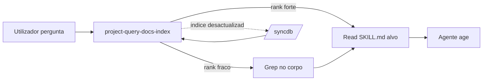

# project-query-docs-index

## Versão interna (ficheiro)

| Campo | Valor |
|-------|-------|
| **FileVersion** | 1.0.0 |
| **Política** | `.cursor/VERSION.md` |

## Responsabilidade única

Esta skill cobre a **consulta** (leitura) dos três índices SQLite com FTS5 do workspace, oferecendo à IA e ao utilizador o fluxo canónico para descoberta offline de skills, agents, rules, docs técnicos e artefactos de workspace via `pack_index_db.py --query`. Cobre a sintaxe FTS5 (operadores, pegadinhas do hífen), filtros por `--type` e `--scope`, receitas canónicas de combinação com `Read`/`grep` e interpretação do ranking BM25. **Não cobre** sincronização/escrita dos índices (delega a `/syncdb`), scan do filesystem (delega a `documentation-project-scan`), produção de documentos de análise (delega a `documentation-analysis-index`) nem consulta a bancos de dados relacionais (delega a `project-open-database-cli`).

## When to use

- "procurar skill sobre X" / "que skill fala de Y"
- "procurar rule de Z"
- "onde está documentado X" / "em que ficheiro posso ler sobre Y"
- "consultar a documentação de Assembly/Delphi offline"
- "listar artefactos de um tópico / categoria"
- "stats do pack" / "quantas skills/rules/docs existem"
- "resolver pergunta offline sem web"
- Antes de carregar um `SKILL.md` completo (≥ 10 KB), usar query para confirmar relevância

## When NOT to use

- **Sincronizar** (escrever) os índices → usar `/syncdb` (command).
- **Scan** do filesystem (descobrir ficheiros novos não indexados) → usar `documentation-project-scan`.
- **Produzir documento** de análise de gaps/status → usar `documentation-analysis-index`.
- **Consultar banco de dados relacional** (SQL Server, MySQL, PostgreSQL...) → usar `project-open-database-cli`.
- **Grep literal** em ficheiros não indexados (ex.: código `.pas`) → usar `Grep` directamente; FTS5 indexa apenas frontmatter + name + keywords.

## Dependências (skills prévias)

| Skill / Command | Quando executar antes |
|-----------------|------------------------|
| `/syncdb` (command) | Pelo menos 1× antes da primeira query — para popular os `.db`. Após edição de skills/rules/docs, repetir para refrescar. |
| `governance-pack-versioning-policy` | Para interpretar versões `_V{X.Y.Z}` dos resultados. |

## Cobertura das 3 bases

| Scope | DB (path) | Conteúdo indexado | Types |
|-------|-----------|-------------------|-------|
| `cursor` | `.cursor/index.db` | `skills/**/SKILL.md`, `agents/*.md`, `rules/*.mdc` | `skill`, `agent`, `rule` |
| `workspace` | `.workspace/index.db` | `skills/**/SKILL.md`, `agents/*.md`, `rules/*.mdc`, `Docs/**/*.md` do clone | `skill`, `agent`, `rule`, `doc` |
| `project` | `E:\.docs\index.db` | `E:\.docs\**\*.md` (docs técnicos offline — Assembly, Delphi, LDAP) | `doc` |

O scope `project` é **opcional**: se `E:\.docs\` não existir, `pack_index_db.py --scan project` é silenciosamente saltado com `[skip]` e a DB não é criada.

## Sintaxe CLI

### Formato base

```bash
python .cursor/scripts/pack_index_db.py --query "<keywords>" [--type <T>] [--scope <S>]
```

### Flags

| Flag | Valores | Default | Efeito |
|------|---------|---------|--------|
| `--query <keywords>` | string FTS5 | — (obrigatória) | Expressão FTS5 (ver secção *Sintaxe FTS5*). |
| `--type <T>` | `skill` · `agent` · `rule` · `doc` | sem filtro | Filtra resultados por tipo de artefacto. |
| `--scope <S>` | `cursor` · `workspace` · `project` · `all` | `all` | Limita a uma base. `all` consulta as 3 e consolida por rank. |

### Retorno

Top-10 resultados ordenados por rank BM25 (ascendente — **menor rank = melhor match**; valores negativos são normais do FTS5 do SQLite). Cada linha mostra `[type] [scope] name -- description` + `path (rank=X.XX)`.

Exemplo:

```text
[skill ] [cursor   ] developer-delphi-to-fpc-horse-jwt -- Middleware JWT para Horse ...
         .cursor/skills/developer-delphi-to-fpc-horse-jwt_V1.0.0/SKILL.md  (rank=-3.42)
```

## Sintaxe FTS5 (essencial)

O SQLite FTS5 suporta **full-text search** com operadores booleanos e prefixos. Regras-chave para este workspace:

### Operadores básicos

| Operador | Exemplo | Efeito |
|----------|---------|--------|
| `AND` (implícito) | `horse jwt` | Ambos os tokens presentes. |
| `OR` | `jwt OR bearer` | Qualquer um. |
| `NOT` | `horse NOT logger` | Inclui `horse`, exclui `logger`. |
| Prefixo `*` | `avx*` | Match em `avx`, `avx2`, `avx512`, `avx10`. |
| Frase exacta | `"calling conventions"` | Exige a sequência exacta. |
| Parênteses | `(jwt OR bearer) AND horse` | Grupos. |

### Pegadinha do hífen (crítico)

O hífen `-` é **operador NOT em FTS5**. Usar `AVX-512` literal faz o SQLite interpretar `-512` como "excluir `512`" → `no such column: 512`.

Fixes:

```bash
# ❌ Erro
python .cursor/scripts/pack_index_db.py --query "AVX-512 VNNI"
# [warn] FTS query falhou em project: no such column: 512

# ✅ Opção 1: usar aspas para forçar frase
python .cursor/scripts/pack_index_db.py --query '"AVX-512" VNNI'

# ✅ Opção 2: remover o hífen (nome canónico do ficheiro)
python .cursor/scripts/pack_index_db.py --query "AVX512 VNNI"
```

A mesma regra aplica-se a `SSE-4.2`, `M01-Seguranca`, `UTF-8`, etc.

### Colunas indexadas

O FTS5 virtual table `artefacts_fts` indexa 4 colunas: `name`, `description`, `keywords`, `frontmatter`. Tokens presentes apenas no **corpo** do `SKILL.md` não são pesquisáveis — confirmar com `grep` se a query FTS5 falhar para um termo que existe no corpo.

## Fluxos / receitas canónicas

### Receita 1 — Encontrar skill por tópico

```bash
# "Preciso gerar JWT em Horse"
python .cursor/scripts/pack_index_db.py --query "jwt horse" --type skill --scope cursor
```

Saída típica: top-ranked = `developer-delphi-to-fpc-horse-jwt_V1.0.0`. Usar `Read` para carregar o SKILL.md completo só após confirmar relevância via query.

### Receita 2 — Localizar rule por keyword

```bash
python .cursor/scripts/pack_index_db.py --query "unit naming" --type rule --scope cursor
```

### Receita 3 — Procurar docs técnicos em `.docs/`

```bash
# Assembly x64 calling conventions
python .cursor/scripts/pack_index_db.py --query '"calling conventions"' --type doc --scope project

# SIMD comparativo
python .cursor/scripts/pack_index_db.py --query "SIMD avx*" --scope project
```

### Receita 4 — Listar artefactos do clone

```bash
# "O que há específico deste clone GestorERP?"
python .cursor/scripts/pack_index_db.py --query "gestorerp OR mxx" --scope workspace
```

### Receita 5 — Stats rápidas por scope / tipo

```bash
python .cursor/scripts/pack_index_db.py --stats
```

Saída mostra totais por scope + breakdown por `type` e `category`.

### Receita 6 — Query → abrir top resultado

```bash
# Passo 1: descobrir
python .cursor/scripts/pack_index_db.py --query "pool connections" --scope cursor
# Obter path top-ranked, ex.: .cursor/skills/developer-delphi-agent-poolconnections-expert_V1.3.0/SKILL.md

# Passo 2: abrir via Read tool (IA) ou editor
Read .cursor/skills/developer-delphi-agent-poolconnections-expert_V1.3.0/SKILL.md
```

### Receita 7 — Combinar com grep para termos no corpo

Se a query FTS5 não devolver resultados mas o utilizador jura que o termo existe:

```bash
# Passo 1: FTS5 falhou ou devolveu pouco
python .cursor/scripts/pack_index_db.py --query "termo-obscuro" --scope cursor

# Passo 2: grep no corpo dos SKILL.md
Grep "termo-obscuro" .cursor/skills/ --glob "SKILL.md" --output_mode files_with_matches
```

## Interpretação do ranking BM25

| Rank aproximado | Significado |
|-----------------|-------------|
| `< -3.0` | Match muito forte (várias keywords + no name/description). |
| `-3.0` a `-1.5` | Match bom. Normalmente é a resposta certa. |
| `-1.5` a `-0.5` | Match fraco — pode ser falso positivo. Confirmar. |
| `> -0.5` | Marginal — provavelmente não é o que o utilizador quer. |

Quando o top-1 tem rank > `-1.5`, vale a pena refinar a query (adicionar sinónimos com `OR`, usar frase exacta) antes de carregar o ficheiro.

## Checklist de operação

- [ ] Índice existe? Correr `/syncdb --stats` antes de concluir "sem resultados".
- [ ] Index fresco? Se edições recentes, correr `/syncdb` antes da query.
- [ ] Hífens em aspas ou removidos? `AVX-512` → `"AVX-512"` ou `AVX512`.
- [ ] Scope adequado? `cursor` para pack, `workspace` para clone, `project` para `.docs/`, `all` quando incerto.
- [ ] Type filtrado quando relevante? `--type skill` reduz ruído em buscas amplas.
- [ ] Rank top-1 ≤ `-1.5`? Caso contrário, refinar query.
- [ ] Antes de carregar `SKILL.md` completo, confirmar relevância pela query.

## Anti-padrões

| Anti-padrão | Por que errado | Como corrigir |
|-------------|----------------|---------------|
| Carregar `SKILL.md` completo sem query prévia | Gasta tokens e contexto desnecessariamente | Usar `--query` primeiro para confirmar relevância; só depois `Read` |
| Usar hífen literal em query | FTS5 interpreta `-` como NOT → `no such column: X` | Aspas duplas envolvendo o termo ou remover o hífen |
| Confundir `/syncdb` com `--query` | `/syncdb` escreve; query só lê | `/syncdb` para refrescar · `--query` para consultar |
| Procurar termo do corpo do `.md` via FTS5 | FTS5 indexa só `name`, `description`, `keywords`, `frontmatter` | Complementar com `Grep` quando o termo pode estar apenas no corpo |
| Ignorar `--scope` | `all` sempre é mais ruidoso; lento em repositórios grandes | Escolher `cursor` / `workspace` / `project` sempre que possível |
| Interpretar rank positivo como bom | BM25 no SQLite FTS5 devolve valores negativos; ordenação ascendente | Menor valor (mais negativo) = melhor match |
| Assumir que `E:\.docs\index.db` existe | Opcional — se `E:\.docs\` foi apagada, DB não existe | Verificar com `/syncdb --stats` antes de `--scope project` |

## Avaliação de risco

- **Baixo:** Leitura de índices existentes; zero side-effect no filesystem.
- **Baixo:** Resultados desatualizados se `/syncdb` não foi corrido após edições recentes.
- **Médio:** Falsos negativos por FTS5 indexar apenas metadados — combinar com `Grep` em casos sensíveis.

## Métricas de sucesso

- Top-1 da query é o artefacto relevante em ≥ 80% dos casos.
- Tempo médio de query < 100 ms (FTS5 local em SQLite).
- Redução mensurável de `Read` desnecessários sobre `SKILL.md` irrelevantes.
- IA prefere `--query` offline antes de web search em pedidos sobre o próprio pack.

## Troubleshooting rápido

| Problema | Causa provável | Ação |
|----------|----------------|------|
| `[query] sem resultados` | Index não existe ou termo ausente | Correr `/syncdb --stats` + verificar se o scope tem dados. Se não tem, rodar `/syncdb`. |
| `no such column: N` (onde N é número) | Hífen interpretado como NOT | Envolver termo em aspas duplas. |
| `fts5: syntax error near "..."` | Operador mal formado | Validar parênteses, `OR`/`AND` escritos em maiúsculas. |
| Rank estranhamente alto (próx. 0) | Match muito fraco — query genérica demais | Adicionar tokens específicos, usar frase exacta. |
| Resultado aponta para ficheiro inexistente | DB desatualizada após delete/move | Correr `/syncdb` (scan remove entradas órfãs). |
| Query devolve entradas de versões antigas | Manifesto antigo no DB | Correr `/syncdb --full` para drop + rebuild completo. |

## Integração com outras skills e commands



- **`/syncdb`** (command) — precursor obrigatório: popula / refresca os DBs.
- **`documentation-project-scan`** (skill) — para descobrir ficheiros **não indexados** (novos no filesystem mas ainda não em DB).
- **`governance-pack-versioning-policy`** (skill) — para interpretar os sufixos `_V{X.Y.Z}` dos paths retornados.
- **`documentation-analysis-index`** (skill) — consumidora: usa resultados de query como *insumos* para produzir análises.

## Referências

- Script: [`.cursor/scripts/pack_index_db.py`](../../scripts/pack_index_db.py)
- Command: [`.cursor/commands/syncdb.md`](../../commands/syncdb.md)
- Esquema SQL: ver docstring do `pack_index_db.py` — tabela `artefacts` + virtual `artefacts_fts` (FTS5).
- SQLite FTS5 (oficial): https://www.sqlite.org/fts5.html
- BM25 no FTS5: https://www.sqlite.org/fts5.html#the_bm25_function

## Changelog (este arquivo)

- 1.0.0 (18/04/2026): Criação — skill de consulta dos três índices SQLite (`.cursor/`, `.workspace/`, `.docs/`) com sintaxe FTS5 (operadores, pegadinha do hífen), 7 receitas canónicas, tabela de interpretação BM25 e integração com `/syncdb`. Complemento leitura-puro do `/syncdb` (escrita). Suporte opcional ao scope `project` (`.docs/`) introduzido em `pack_index_db.py` 1.1.0 (18/04/2026).
