# FLOWCHART — Dependências entre módulos ZipFileORM v4.0.0

```mermaid
flowchart TB
    Consumer["Consumer<br/>uses ZipFileORM;"]

    subgraph Facade["FACADE — ZipFileORM.*"]
        ZipFileORM["ZipFileORM.pas<br/>TArchive factory"]
        ZipFileORM_Iface["ZipFileORM.Interfaces<br/>IArchive, IArchiveEntry"]
        ZipFileORM_Comp["ZipFileORM.Compression<br/>TCompressionMethod"]
        ZipFileORM_Evt["ZipFileORM.Events<br/>15 TArchive*Event"]
    end

    subgraph Formats["MÓDULOS FORMAT (10)"]
        ZipFile["ZipFile.pas<br/>TZipFile"]
        TarFile["TarFile.pas<br/>TTarFile"]
        TarGzFile["TarGzFile.pas<br/>TTarGzFile"]
        GzipFile["GzipFile.pas<br/>TGzipFile"]
        CabFile["CabFile.pas<br/>TCabFile"]
        SevenZFile["SevenZFile.pas<br/>TSevenZFile"]
        ArjFile["ArjFile.pas<br/>TArjFile"]
        IsoFile["IsoFile.pas<br/>TIsoFile"]
        LhaFile["LhaFile.pas<br/>TLhaFile"]
        RarFile["RarFile.pas<br/>TRarFile"]
    end

    subgraph SubMods["SUB-MÓDULOS FORMAT-ONLY"]
        ZIP64["ZipFile.ZIP64"]
        UTF8["ZipFile.UTF8"]
        Streaming["ZipFile.Streaming"]
        TarGzipStream["TarFile.GzipStream"]
    end

    subgraph Helpers["HELPER STREAMS"]
        Bzip2Stream["Bzip2.Stream"]
        UUEStream["UUE.Stream"]
        ZCompressLzw["ZCompress.LzwStream"]
    end

    subgraph Detect["AUTO-DETECT"]
        ArchiveOpen["Archive.Open<br/>magic byte detection"]
    end

    subgraph Commons["COMMONS — utilitários cross-format"]
        CommonsAES["Commons.Encryption.AES"]
        CommonsLZMA["Commons.Compression.LZMA"]
        CommonsZLib["Commons.Compression.ZLib"]
        CommonsBase["Commons.Compression.Base"]
        CommonsNone["Commons.Compression.None"]
        CommonsProgress["Commons.Progress"]
        CommonsTypes["Commons.Types"]
        CommonsExc["Commons.Exceptions"]
        CommonsConsts["Commons.Consts"]
    end

    Consumer --> ZipFileORM
    ZipFileORM --> Formats
    ZipFileORM --> ZipFileORM_Iface
    ZipFileORM --> ZipFileORM_Comp
    ZipFileORM --> ZipFileORM_Evt
    ZipFileORM --> ArchiveOpen

    ZipFile --> ZIP64
    ZipFile --> UTF8
    ZipFile --> Streaming
    ZipFile --> CommonsAES
    ZipFile --> CommonsLZMA
    ZipFile --> CommonsZLib
    ZipFile --> CommonsBase
    ZipFile --> CommonsNone
    ZipFile --> CommonsConsts
    ZipFile --> CommonsProgress

    TarFile --> TarGzipStream
    TarGzFile --> TarFile
    TarGzFile --> TarGzipStream
    GzipFile --> TarGzipStream

    SevenZFile --> CommonsLZMA

    ArjFile --> Commons
    IsoFile --> Commons
    LhaFile --> Commons
    RarFile --> Commons
    CabFile --> Commons
    GzipFile --> Commons

    Formats --> ZipFileORM_Evt
    Formats --> CommonsTypes
    Formats --> CommonsExc

    style Facade fill:#e1f5ff
    style Commons fill:#fff4e1
    style Formats fill:#e8f5e1
    style SubMods fill:#f0e1ff
    style Helpers fill:#ffe1e1
    style Detect fill:#e1e1ff
```

## Leitura do diagrama

- **Consumer** → entra pela facade `ZipFileORM.pas`.
- **Facade** → re-exporta os 10 módulos format + contratos públicos + detect.
- **Módulos format** → consomem Commons.* (utilitários cross-format) + sub-módulos próprios (ZIP64, UTF8, etc.).
- **Helper streams** (Bzip2/UUE/ZCompress) → independentes, usados via uses direto pelos formatos relevantes.
- **Commons** → camada mais profunda, sem dependências internas circulares.
